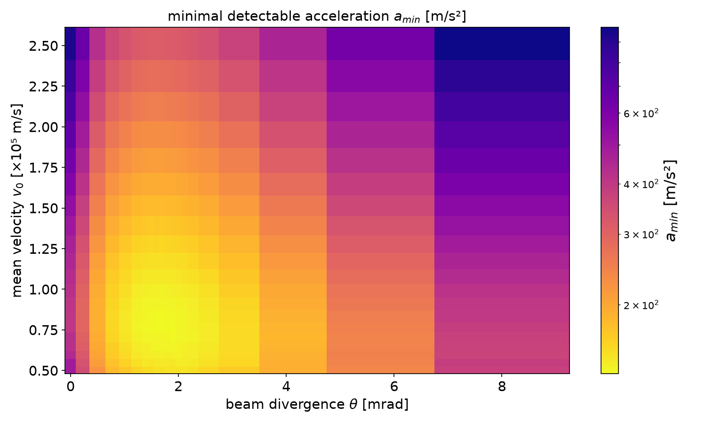

# thesis-code

code from my thesis

## thesis, for reference

[thesis.pdf](thesis/thesis_Winiarski_(watermarked).pdf)

## how to run (recommended)

```bash
# set up venv (once)
python -m venv venv
# activate venv
source venv/bin/activate # Linux
./venv/Scripts/activate # Windows
# initialise requirements (once)
pip install -r requirements.txt
# run
python <name>.py
```

## how to generate plots

in progress...

### Figure 3.10

