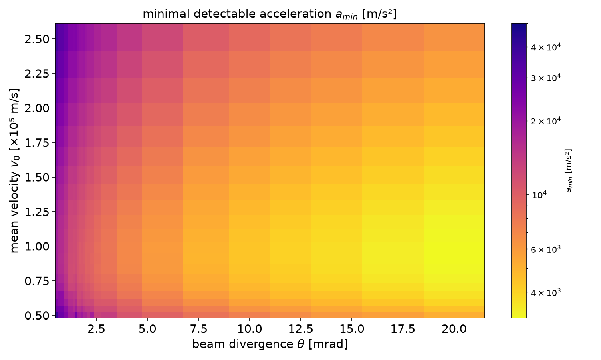
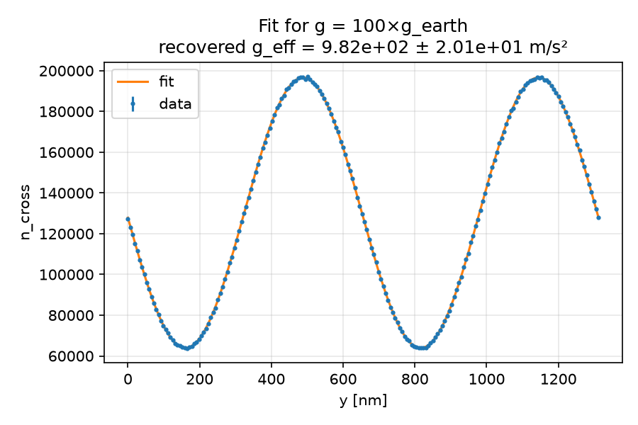

# thesis-code

code from my thesis

## thesis, for reference

[thesis.pdf](thesis/thesis_Winiarski_(watermarked).pdf)

## how to run (recommended)

```bash
# set up venv (once)
python -m venv venv
# activate venv
source venv/bin/activate # Linux
./venv/Scripts/activate # Windows
# initialise requirements (once)
pip install -r requirements.txt
# run
python <name>.py
```

## how to generate plots

in progress...

### Moir\'e deflectometer

#### Figure 3.5


`python moire/particles_heatmap.py` 
then wait for the simulation to run, or press Ctrl+C to load the data from CSV

### Mach--Zehnder interferometer

#### Figure 3.8



#### Figure 3.10


`python machzehnder/optimize_velocity.py`
then wait for the simulation to run, or press Ctrl+C to load the data from CSV
